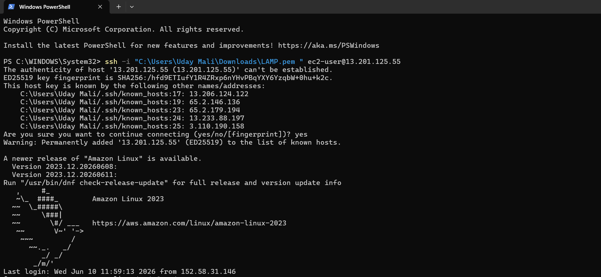
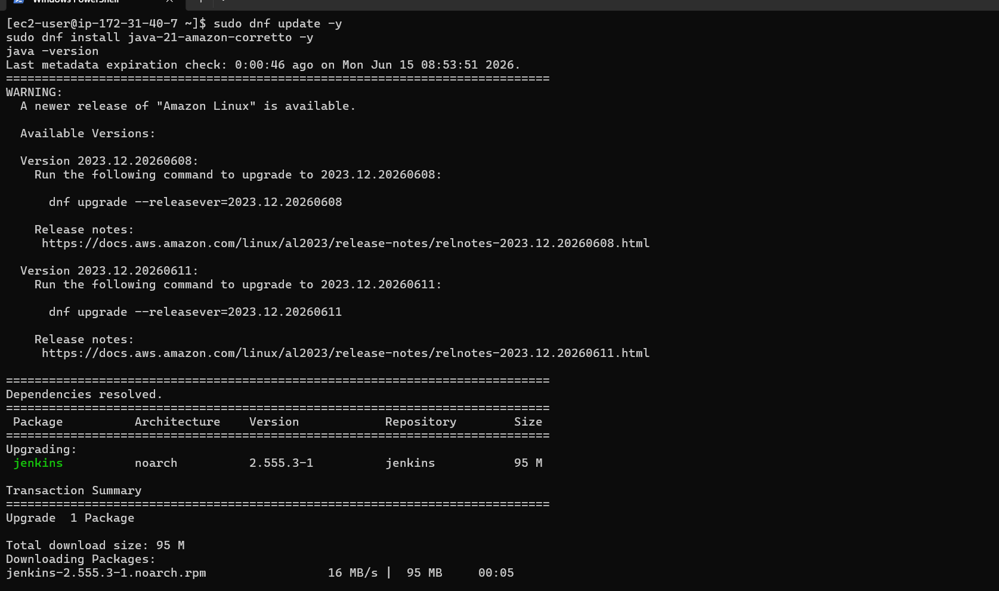
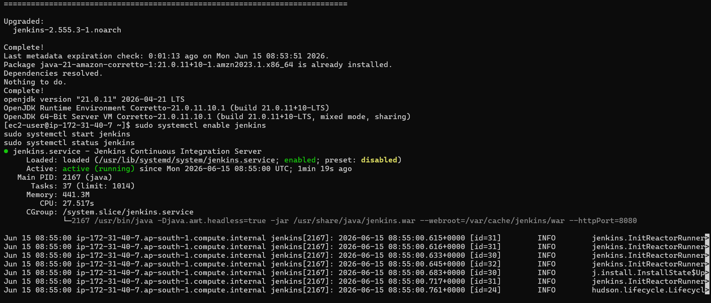
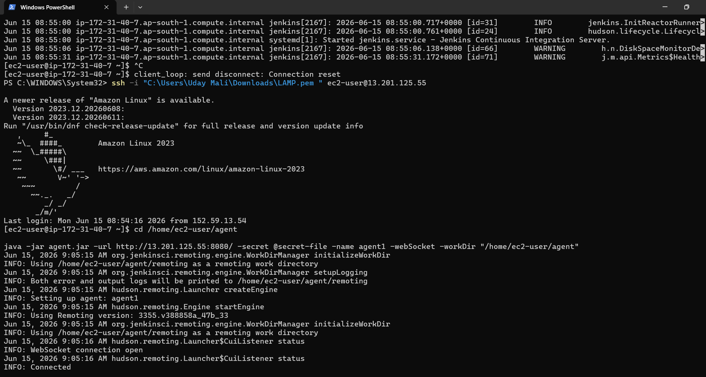
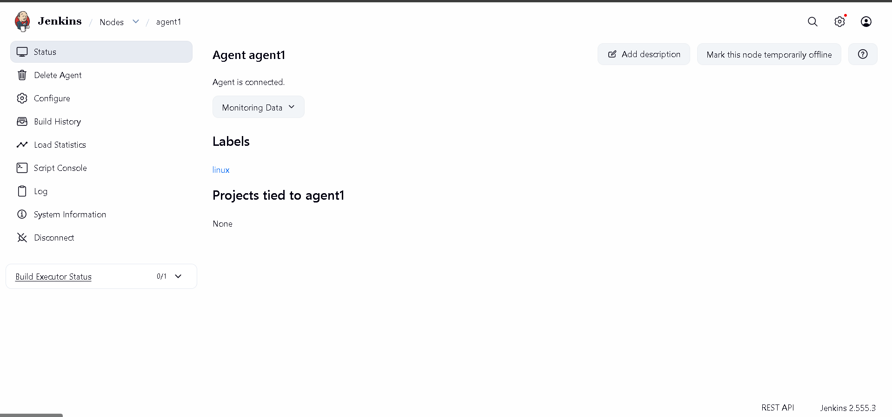

# Task 2 - Jenkins Remoting Project

## Objective

Set up Jenkins Remoting to connect a remote Jenkins Agent with the Jenkins Controller.

## Tools Used

* AWS EC2
* Amazon Linux 2023
* Java 21
* Jenkins
* Jenkins Agent

## Steps Performed

1. Launched an AWS EC2 instance.
2. Connected to EC2 using SSH.
3. Installed Java 21.
4. Verified Java installation.
5. Created a Jenkins Agent node.
6. Configured agent settings.
7. Downloaded agent.jar.
8. Connected the agent using WebSocket.
9. Verified agent connection from Jenkins Dashboard.

## Result

Successfully connected a remote Jenkins Agent with Jenkins Controller.

## EC2 Login

## Java Installation

## Jenkins Running

## Agent Connected Terminal

## Agent Connected Dashboard

