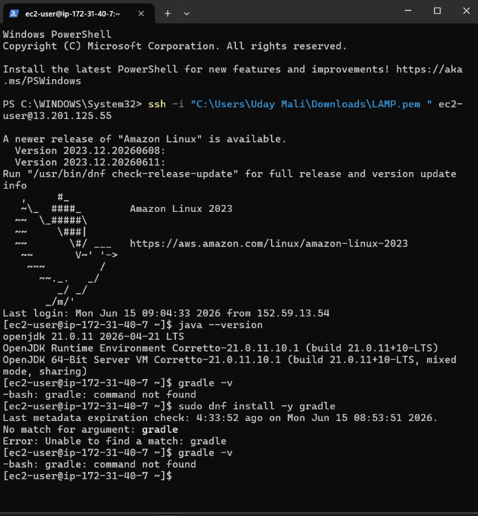
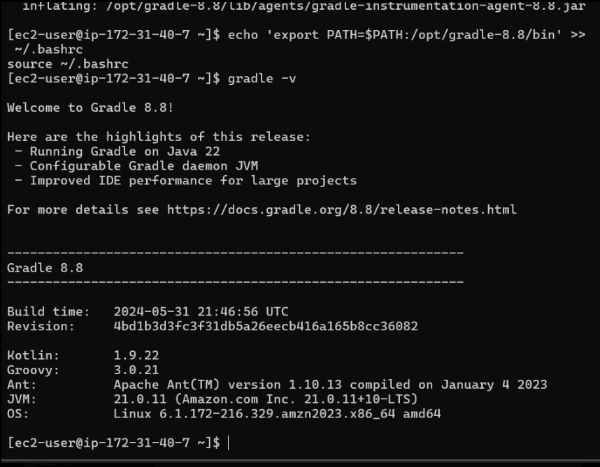
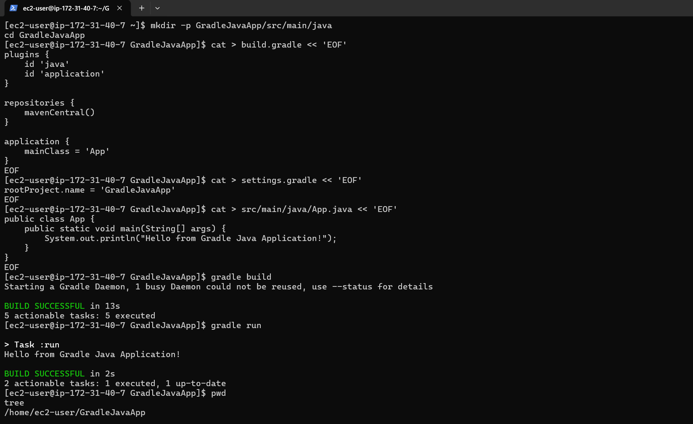
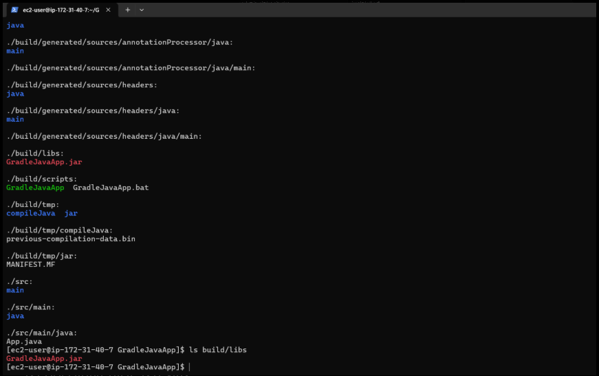

# Task 3 - Java Application using Gradle

## Objective

Build and run a simple Java application using Gradle.

## Tools Used

- AWS EC2
- Amazon Linux 2023
- Java 21
- Gradle 8.8

## Steps Performed

1. Connected to AWS EC2 instance.
2. Verified Java installation.
3. Installed Gradle 8.8.
4. Created a Gradle Java project.
5. Configured build.gradle and settings.gradle.
6. Created App.java.
7. Built the project using Gradle.
8. Executed the application using Gradle.
9. Verified project structure and generated JAR file.

## Result

Successfully built and executed a Java application using Gradle on AWS EC2.

## Screenshots

### Java Version

### Gradle Installation

### Build Successful

### Project Structure

